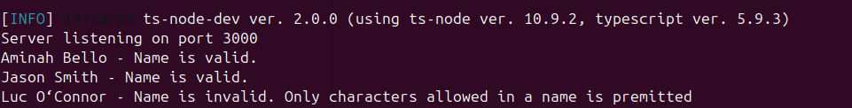
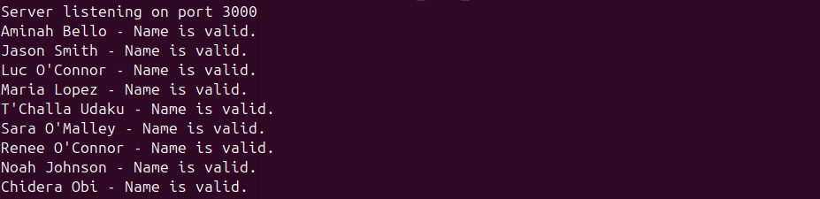
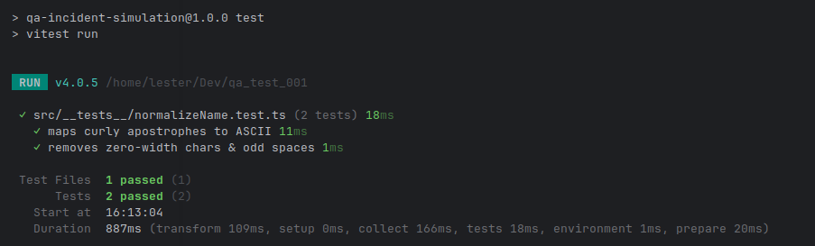

# QA Incident Simulation

This repository reproduces a real customer issue that slipped past automated checks. Use it to practice end-to-end debugging, implement a production-ready fix, and lock the behaviour down with tests. Treat this as an assessment: the final deliverable includes code changes and accompanying tests.

## Background

- We validate user names against an external service (`https://schoolbaseapp.com/validate-name`).
- The sample data under `data/users.json` includes a mix of names that should succeed and fail so you can trace requests across the system.
- The Express app forwards each name to the validation endpoint and logs the response in the format `Name - message`.

## Getting Started

1. Install dependencies (Node 18+ recommended):
   ```bash
   npm install
   ```
2. Start the dev server:
   ```bash
   npm run dev
   ```
3. Exercise the endpoint from another terminal:
   ```bash
   curl http://localhost:3000/api/validate-users | jq
   ```

> Tip: `GET /health` returns a simple status payload if you just need to confirm the server is running.

## What You Should Observe

- The request currently fails with a 400 (Bad Request) response.
- The failure comes from the remote validation service rejecting at least one of the sample names.
- You will need to investigate why particular names fail even though they appear to be correct.

## Your Mission

1. Reproduce the failure locally and identify the exact data problem that causes the rejection.
2. Implement a fix in the validation flow so that every name in `data/users.json` passes the external check.
3. Add automated regression coverage (ensure `npm run test` runs your test) that covers both the `validateUser` logic and the `/api/validate-users` endpoint so the scenario stays fixed.
4. Fork this repository, commit your solution, and send the link to your fork to Emmanuel via WhatsApp by Thursday, Oct 30th at 11:59 PM GMT.

You are free to refactor the code or add tooling to support your investigation—just keep the reproduction steps intact for the next engineer who picks this up. **Do not modify `data/users.json`; all fixes must live in the application code or supporting tests.**

Good luck, and have fun tracing the bug!

## Fix Summary

### Overview
The app validated user names against an external API but failed for names with **Unicode characters** (e.g., curly apostrophes and accented letters).  
This fix normalizes names before validation so all entries in `data/users.json` pass successfully.

---

### Issue
**Before Fix:**

I had an error which meant **Name is invalid. Only characters allowed in a name is premitted*. This error was due to the external API not recognizing some characters in the names. To fix this I had to create a helper function to sanitize the names before sending to the API for validation.



**After fix**

The helper function **normalizeName()** cleans and standardizes user names before sending them to the external validation API.



**Test Results**

I installed Vitest to help simulate our test and created a new test file normalizeName to map curly apostrophes to ASCII and also remove zero-width and odd spaces




